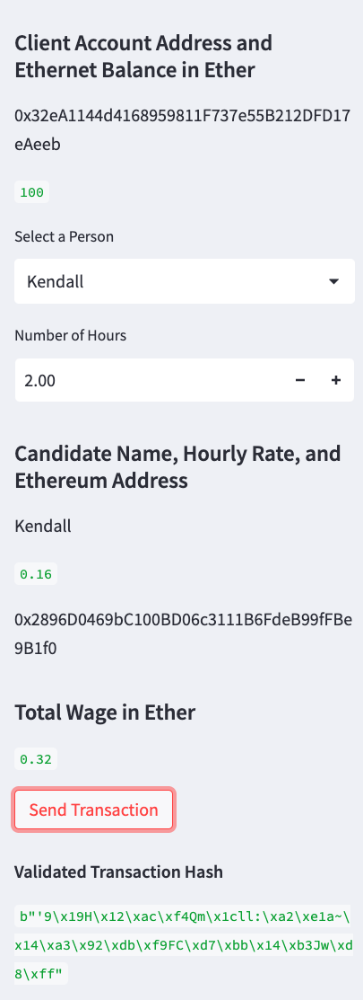
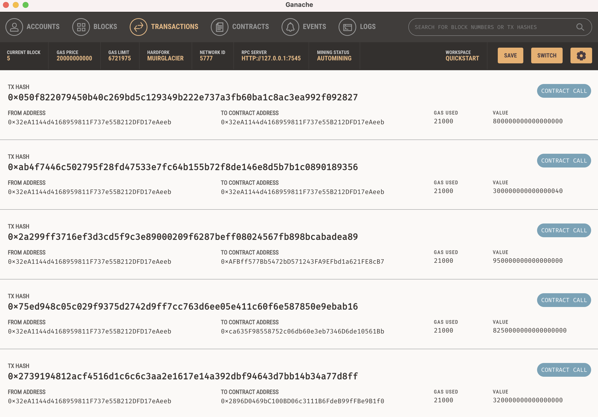
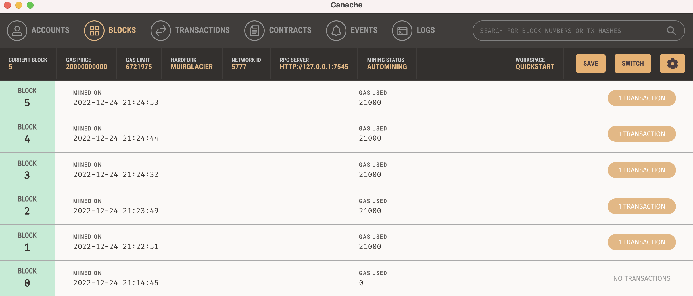

# Module_19_KryptoJobs2Go
## Blockchain Wallet Challenge

### Background...
The task was to work at a fictional startup that is building a new and disruptive application named KryptoJobs2Go. Customers use KryptoJobs2Go to find fintech professionals from a list of candidates, hire them, and then pay them. I have integrated the Ethereum blockchain network into the application to enable the customers to instantly pay their hired fintech professionals with cryptocurrency.

#### This was done by the following steps;

1.  Import Ethereum transaction functions into the KryptoJobs2Go application.
2.  Sign and run a payment transaction.
3.  Inspect the transaction in Ganache.

#### The following screens shots support these outcomes:

Screenshot_1: Streamlit application sidebar showing client address, account balance and then the candidate selection and rate with address before the total payable balance. Finally, a "Send transation" button and validated hash.

Screenshot 2: is the Ganache account transactions confirming recent transaction movements, account addresses, value in wei and associated GAS used for the transations.

Screenshot 3: shows the blocks mined, date and time and again the GAS used.

